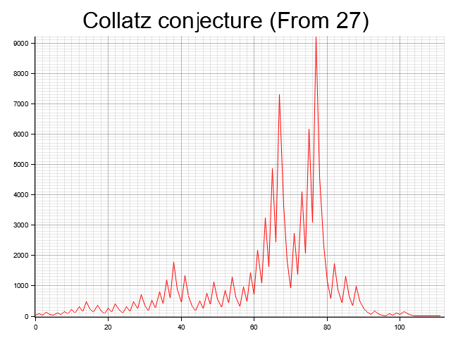

# Collatz Conjecture

The Collatz conjecture, also known as the 3x+1 problem is defined by Wikipedia as:
>A conjecture in mathematics that concerns sequences defined as follows: start with any positive integer n. Then each term is obtained from the previous term as follows: if the previous term is even, the next term is one half of the previous term. If the previous term is odd, the next term is 3 times the previous term plus 1. The conjecture is that no matter what value of n, the sequence will always reach one.

This program aims to run numbers through the conjecture and plot integers from the conjecture on a plot.

## Example output
